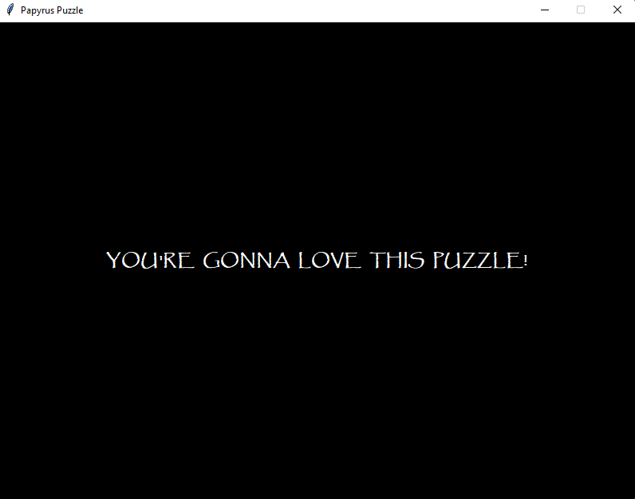
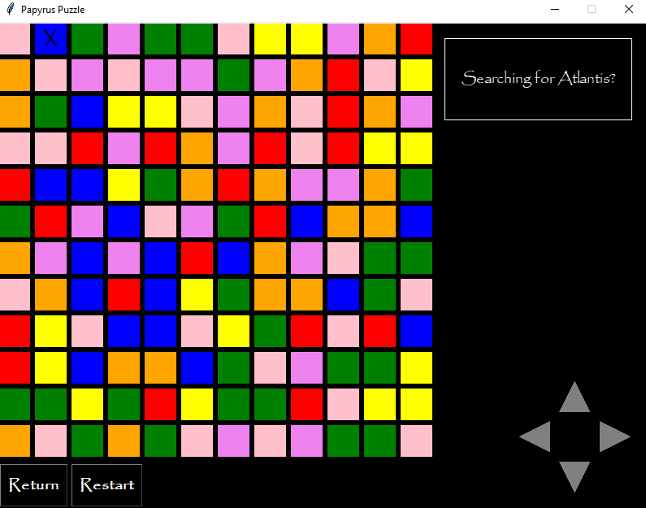
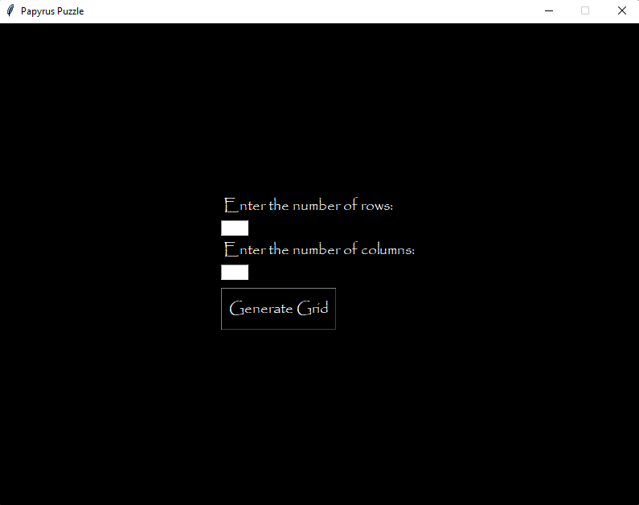
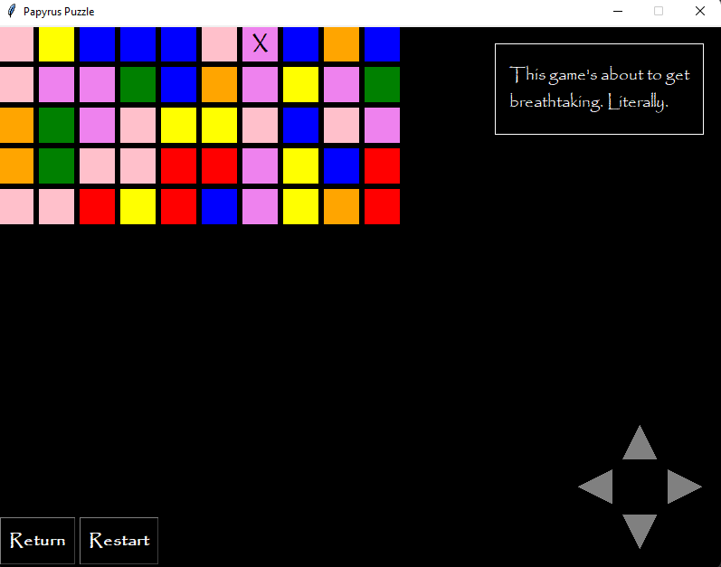

# Papyrus's Tile Puzzle Simulator

This is a Python-based simulator for Papyrus's tile puzzle from the game *Undertale*, built using `tkinter`.
The simulator recreates the rules and randomness of the original puzzle, allowing players to experience Papyrus's
quirky puzzle.

## Features

- **Random Tile Generation**: Each run generates a unique tile grid with random colors, mimicking the unpredictability
of Papyrus's puzzle.
- **Interactive Gameplay**: The user can interact with the puzzle and see the effects of different tile types as per
the original game's rules.
- **Graphical Interface**: The puzzle is displayed using a graphical user interface created with `tkinter`.

## Installation

1. **Clone the repository**:
   ```bash
   git clone https://github.com/ananemyro/papyrus-tile-puzzle.git
   
2. **Navigate to the project directory:**:
   ```bash
   cd papyrus-tile-puzzle

3. **Run the game:**:
   ```bash
   python main.py

## How to Play
The rules of the puzzle are as follows:

- **Red Tiles**: Impassable! You cannot walk on them.
- **Yellow Tiles**: Electric! They will electrocute you.
- **Green Tiles**: Alarm tiles! If you step on them, you will have to fight a monster. If you do, there is a 50% chance
of you losing and going back to where you started from.
- **Orange Tiles**: Orange-scented. They will make you smell delicious.
- **Blue Tiles**: Water tiles. Swim through if you like, but if you smell like oranges, the piranhas will bite you. Also, if
a blue tile is next to a yellow tile, the water will also zap you!
- **Purple Tiles**: Slippery! You will slide to the next tile. However, the slippery soap smells like lemons, which piranhas
do not like! Purple and blue are okay.
- **Pink Tiles**: They don't do anything. Step on them all you like.

## Screenshots

Here are some screenshots of the puzzle in action:

|               |          |
|:----------------------------------------------:|:------------------------------------------------:|
|                  Introduction                  |                 Big Grid Example                 |
|  |  |
|                Grid Generation                 |               Smaller Grid Example               |

## Acknowledgements
*Undertale*: Created by Toby Fox. This simulator is a fan project and is NOT affiliated with or endorsed by the creators 
of Undertale.